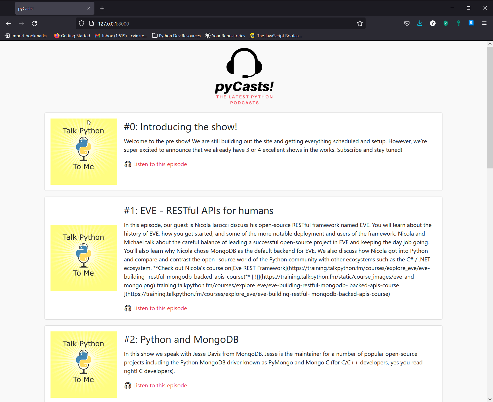

# Content-Aggregator-WebApp

* Building a Content Aggregator with the Django Web Framework 🚲

* Inspiration behind the project: This is to gather all of the contents and important information from your favourite subjects into one single place.

* The Content Aggregator Webapp would source all of the RSS feeds from all of the Podcasts Episodes of Real Python.

* Kudos to @RealPython for the amazing tutorials and lessons that they have shared on their wonderful website <https://realpython.com/> 🥰

* Skills learned while working on the Content Aggregator Web App project:
    1. How to work and deal with RSS feeds
    2. How to create a Django custom management command
    3. How to run your custom command automatically on a schedule
    4. How to use unit tests to test your Django app's functionality

## What does it look like?

* The content aggregator Web App is a Podcast Content Aggregator in Python named *pyCasts!*

* The application will be a single web page displaying the latest Python podcast episodes from the **Real Python Podcast <https://realpython.com/podcasts/rpp/>** and the **Talk Python To Me Podcast <https://talkpython.fm/>**

    

## Project Steps to complete

1. Setting up the Django Project
2. Build the podcast model
3. Create the homepage view
4. Parse a podcast RSS feed
5. Create a Django custom command
6. Add additional feeds
7. Schedule tasks with Django-apscheduler

## Tools and Libraries that have been used

* *feedparser* library - fetching the podcast RSS feeds into the web application and parsing them. This would aid you in getting the latest episode data from that certain feed! Next, we would be **marshalling** that data into an Episode model and save to the database with the Django ORM.
* *Custom management command* - built-in Django Tool that will help you in creating custom scripts for your automation requirements / needs. With this, we would be able to parse and save the data within the Django ecosystem.
* *django-apscheduler* - **setting a schedule** for our custom function calls, which are also called *jobs*. Viewing them in your Django Admin page is a convenient way to monitor all of the jobs that have been ran and when those jobs have been executed.
    This will ensure that your automated fetching and parsing of the feed happens successfully without any more admin intervention.
* *Django template engine* - showing the user the queried context - other words, the latest episodes!

## What Technologies have been used in these project? ✨

1. Python version 3.9.0+
2. Virtual Environment in Python
3. HTML and CSS
4. Django web framework features and its concepts like the following:
    * Folder Structure
    * URL routing
    * Migrations
    * Creating a Project and App
5. Bootstrap 4

## Steps done in setting-up the Django project

    (.venv) C:\Users\Clarence Vinzcent\Content-Aggregator-WebApp>python manage.py check
    System check identified no issues (0 silenced).

    (.venv) C:\Users\Clarence Vinzcent\Content-Aggregator-WebApp>python manage.py startapp podcasts

    (.venv) C:\Users\Clarence Vinzcent\Content-Aggregator-WebApp>py manage.py makemigrations && py manage.py migrate

    (.venv) C:\Users\Clarence Vinzcent\Content-Aggregator-WebApp>py manage.py createsuperuser
